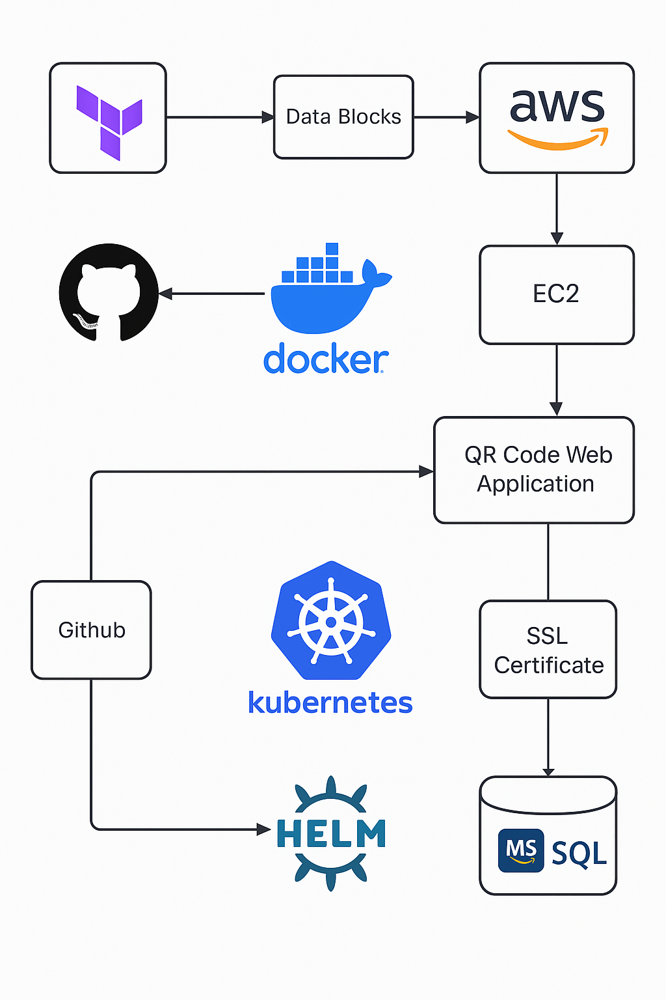

# 🚀 DEPi Internship DevOps Project – QR Code Generator
> The QR Code Generator is a cloud-native, containerized application designed to generate and manage QR codes with ease. It showcases a real-world DevOps pipeline with infrastructure automation, Kubernetes-based orchestration, and secure secrets handling.

> This repository is perfect for developers and DevOps engineers aiming to gain hands-on experience in deploying scalable applications using modern tools like Docker, Helm, Terraform, and Kubernetes (Kind). It follows industry-standard best practices for CI/CD and infrastructure as code (IaC).

---
# Architecture

## 🌐 Tech Stack

### Application Layer

- **Frontend**: HTML, CSS, JavaScript  
  A lightweight, responsive interface for users to input data and generate QR codes. Built without heavy frameworks to keep the app simple and portable.

- **Backend**: [Flask / Node.js / other]  
  A minimal API service responsible for generating QR codes and optionally storing/retrieving data using a Microsoft SQL Server database hosted on AWS RDS.

---

### DevOps & Infrastructure

- **Docker**  
  Used to containerize both frontend and backend applications, ensuring consistency across development, testing, and production environments.

- **Kubernetes (Kind)**  
  Kind is used to run a local Kubernetes cluster for testing and validation. This simulates a production-like orchestration environment without relying on cloud infrastructure.

- **Helm**  
  Kubernetes package manager used to streamline application deployment. Helm charts provide reusable, configurable templates for services and deployments.

- **Terraform**  
  Infrastructure as Code (IaC) tool used to provision and manage AWS resources — primarily an RDS (MSSQL) instance and supporting infrastructure — in a repeatable, version-controlled manner.

- **Ingress-NGINX**  
  Acts as the Kubernetes ingress controller to expose services outside the cluster and handle HTTP routing for the application.

- **Secrets Management: `.env` file**  
  Environment-specific configuration and secrets are managed using a `.env` file. For production environments, this could be extended using AWS Systems Manager (SSM) or Secrets Manager.

- **Version Control: GitHub**  
  The entire codebase is maintained on GitHub for collaboration, version tracking, and integration with CI/CD workflows if needed.

---
## 📁 Project Structure
'''
├── backend/ # Backend application (API logic for QR code generation)
├── frontend/ # Frontend assets (HTML/CSS/JS)
├── charts/ # Helm charts for Kubernetes deployment
├── terraform/
│ ├── main.tf # Root configuration for AWS infra
│ └── rds.tf # RDS provisioning (MSSQL)
├── kind-config/ # Configuration files for setting up Kind
├── installation.sh # Script to install Kind, Helm, Ingress, etc.
├── docker-compose.yml # Optional: for local Docker-based testing
├── .env # Local environment variables (credentials, configs)
└── README.md # Project documentation '''

---

## 🔐 Secrets Management

- Secrets (like DB credentials) are stored in a `.env` file.
- During deployment, Helm is used with `--set-string` or templates to inject these values into the Kubernetes cluster.
- For production-grade deployments, consider replacing `.env` with AWS SSM Parameter Store or AWS Secrets Manager for better security and automation.

---
## 📌 Best Practices Followed

- Infrastructure as Code (IaC) using Terraform for repeatable AWS setup.
- Kubernetes Helm charts for modular, parameterized deployments.
- Clean separation of concerns: infrastructure, app, and deployment logic are clearly segmented.
- Local development mimics cloud production environment as closely as possible.
- Secure environment variables usage and separation of sensitive data.
---
## 🚀 Deployment Methods

### 1. Local Deployment using Docker 🐳  
#### 📥 Step 1: Install Docker

Make sure Docker is installed on your system.

- 🔗 [Install Docker](https://docs.docker.com/get-docker/)

> Docker Compose is included with Docker Desktop on Windows and Mac. On Linux, install it separately if needed: [Install Docker Compose](https://docs.docker.com/compose/install/)

---

#### ▶️ Step 2: Run the application

```bash
cd /path/to/docker-compose.yaml  # Navigate to the folder containing the docker-compose.yaml file
docker-compose up --build
```
**This will:**

- Start the SQL Server container (mcr.microsoft.com/azure-sql-edge)

- Build and run the QR Code application

- Make the app accessible at: http://localhost:9000


---

### 2. Local Deployment using Kind and Helm ☸️

#### 📥 Step 1: Install the required tools
To install all tools (Docker, Kind, kubectl, Helm), run:
``` bash 
chmod +x kind-helm-setup.sh
./kind-helm-setup.sh
```

#### ▶️ Step 2: Deploy the application on Kind

``` bash
sudo -E helm install qrcode ./QRCode_APP_Chart \
  --set-string Secret.DB_PASSWORD="MY_db_password123" \
  --set-string Secret.DB_HOST="sql-db" \
  --set-string Secret.DB_NAME="QRCodeDatabase" \
  --set-string Secret.DB_USER="sa"
```
**Notes:**

- Make sure the QRCode_APP_Chart directory is in the same path you run the command from.

- You can check if everything is working using:

``` bash 
kubectl get pods
kubectl get svc
```
####  Step 3: Accessing the App (Kubernetes Deployment)
``` bash
# Check if the ingress controller is running
kubectl get pods -n ingress-nginx  # should show Running status

# List ingress resources to get the host name
kubectl get ingress  # Look for the HOSTS column (e.g., qrcode.local)

# Map the ingress domain to localhost (edit /etc/hosts)
echo "127.0.0.1 qrcode.local" | sudo tee -a /etc/hosts  # map domain to local

# Now open the app in browser at:
# http://qrcode.local
```

---

### 3. Deploy to Production Environment (Recommended)

This deployment targets AWS infrastructure, using Terraform to provision backend services (e.g., RDS) and Helm to deploy the application into a production-ready K8s cluster.

**Steps**:

```  bash 


 ```
---
## 🙋 Contributors

- **GitHub**: [Your GitHub Username]
- **LinkedIn**: [Your LinkedIn URL]

---

## 📄 License

This project is licensed under the [MIT License](LICENSE).

